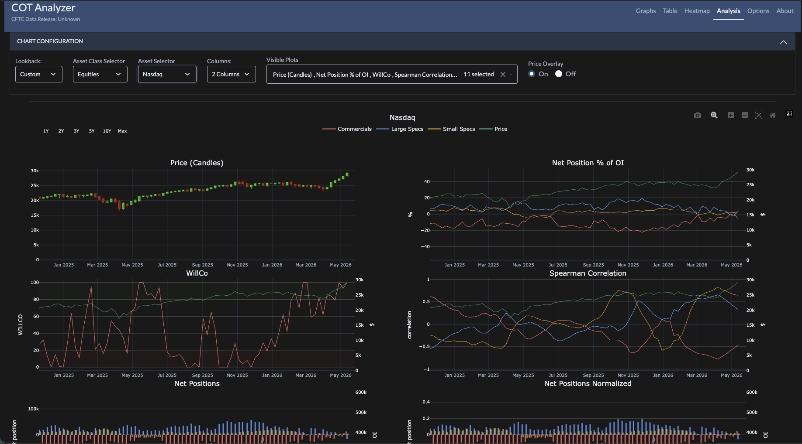
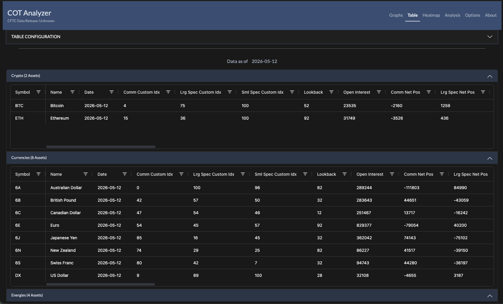

# COT Analyzer

[](https://www.python.org/)
[](https://opensource.org/licenses/MIT)

A Dash/Plotly web app for exploring [CFTC](https://www.cftc.gov/MarketReports/CommitmentsofTraders/index.htm)
Commitments of Traders positioning. It's the UI layer on top of the
[`cotmetrics`](https://github.com/mspinola/cotmetrics) metrics library and the
[`cotdata`](https://github.com/mspinola/cotdata) store; it computes no metrics of its
own. Given the CFTC legacy report, it will:

* generate CSV files with per-symbol data
* generate RealTest data as an Event List for each symbol
* calculate the COT index from configurable lookbacks for the 3 COT categories (Commercials, Large Speculators, Small Speculators)
* render positioning plots via Dash/Plotly for browser viewing
* periodically download updated COT reports (released Fridays at 3:30 US/Eastern)




> **This is a source application, not a PyPI package.** Clone it and run it. It expects
> the `cotdata` and `cotmetrics` siblings checked out alongside it (`../cotdata`,
> `../cotmetrics`) — `requirements.txt` installs them editable — and a populated
> `COTDATA_STORE`. See Setup below.

## COT Data

Description of [COT Legacy Report data fields](https://www.cftc.gov/MarketReports/CommitmentsofTraders/HistoricalViewable/deanexplanatory.html)

## Setup (uv)

Check out the sibling repos alongside this one first, so the editable installs in
`requirements.txt` resolve:

```bash
git clone https://github.com/mspinola/cotdata
git clone https://github.com/mspinola/cotmetrics
git clone https://github.com/mspinola/cot-analyzer
cd cot-analyzer
uv venv
source .venv/bin/activate
uv pip install -r requirements.txt   # includes the editable siblings (-e ../cotdata, -e ../cotmetrics)
```

`requirements.txt` pulls in two local sibling packages, both editable:

* **cotmetrics** (`-e ../cotmetrics[options,scheduler]`) is the data and metrics layer. It
  owns the indexer, the COT index and signals, the ETL and scheduler, and options data.
  This repo is the Dash application on top of it and computes no metrics of its own.
* **cotdata** (`-e ../cotdata`) is the store beneath that. Prices and COT are read through
  `cotdata.get_prices` / `cotdata.get_cot`, backed by a shared file store.

Point `COTDATA_STORE` at that store. Put it in `.env` at the repo root (gitignored) so both
the launcher and the systemd unit pick it up:

```bash
echo 'COTDATA_STORE=~/code/cotdata_store' >> .env
```

## Run

```bash
./run-local.sh
# generated data lives in ./data ; view in a browser at http://127.0.0.1:5001
```

Use the launcher rather than `python src/main.py` directly. It changes to the repo root
(several config reads resolve relative paths), points `COTMETRICS_CACHE` at this repo's
`data_cache/`, points `COTMETRICS_PARAMS` and `COT_VIZ_CONFIG` at the sibling
`../cotmetrics-config/params.yaml` when that private config repo is checked out alongside
(otherwise the metrics and viz layers fall back to the packaged sample and warn), sources
`.env`, and fails loudly if `COTDATA_STORE` is unset rather than surfacing later as
confusing empty data. You can still run `python src/main.py` directly if you export those
variables yourself.

## Configuration

Yaml config file lives in config/params.yaml

`lookbacks` defines the looback periods in which indexes are calculated

`years` defines the years in which historical CFTC COT is downloaded

`AssetClasses` defines classes of symbols for analysis

* `Name` is a string reference of the instrument
* `Symbol` is the instruments symbol ID - generally TradingView based as a default
* `Code` is the CFTC assigned ID code for each instrument. Symbol to code mapping lives in `cotmetrics.symbol_code_map` (in the cotmetrics sibling)
* `TV_Chart` TV doesn't chart futures in its `widgets` platform so this is a similar symbol for widget charting.
* `CustomLookbackWeeks` allows defining one custom lookback period per instrument

## Server Side Configuration

login

```bash
sudo apt install git pip
pip install uv
curl -LsSf https://astral.sh/uv/install.sh | sh
git clone git@github.com:mspinola/cot-analyzer.git

cd cot-analyzer
uv venv
uv pip install -r requirements.txt
cp cot-analyzer.service /etc/systemd/system
systemctl enable cot-analyzer
```

### Syncing Local Cache to Server (Recommended)

To avoid subjecting your production server to massive 15-year synchronous backfills or computationally heavy historical calculations, you should **never** check the `data_cache/` directory into Git (doing so will rapidly bloat your repository size).

Prices come from Norgate, which is Windows-only, so the server cannot produce them at
all: do the heavy data work on the producer machine and sync the binaries over SSH.

```bash
# Run this from the producer's cot-analyzer root directory:
rsync -avz --no-o --no-g --progress ./data_cache/ user@your-server-ip:/path/to/server/cot-analyzer/data_cache/
```

The server also needs `COTDATA_STORE` synced. Most of `./data` does **not** need to
travel, since the CFTC archives in it are downloaded and the CSV exports are generated.

**See [server-side/README.md](server-side/README.md)** for the full setup: which repos
the server needs, the complete environment variable list, exactly what to sync, and the
upgrade procedure. That file is the source of truth for deployment.

## License

MIT — see [LICENSE](LICENSE).


