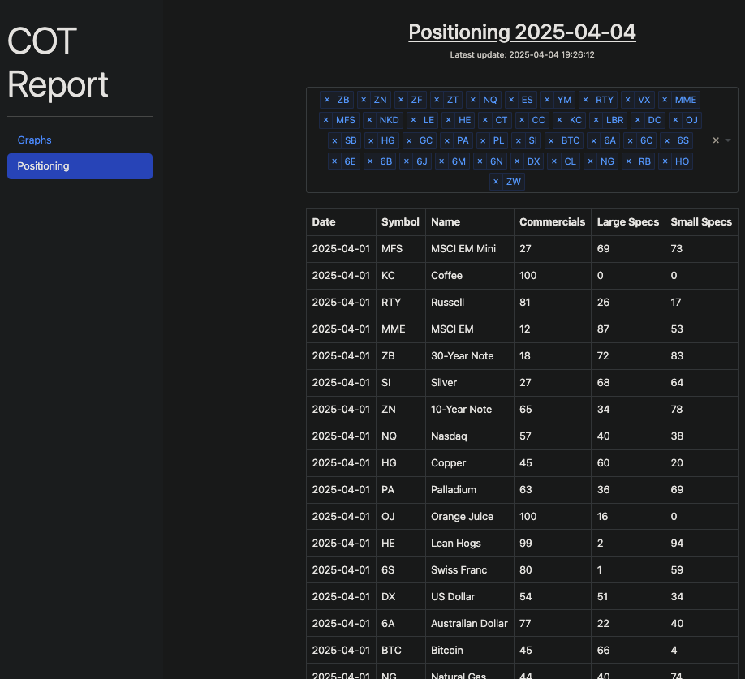

# COT Analyzer

Application to download [CFTC](https://www.cftc.gov/MarketReports/CommitmentsofTraders/index.htm) COT legacy report:

    * generate csv files with per symbol data
    * generate RealTest data as an Event List for each symbol
    * calculate COT index value based on configurable lookback values for the 3 COT categories (Commercials, Large Speculators, and Small Speculators)
    * generate visualization plots via Dash/Plotly for web browser viewing
    * periodically download updated COT reports (released Fridays at 3:30 US/Eastern)




## COT Data

Description of [COT Legacy Report data fields](https://www.cftc.gov/MarketReports/CommitmentsofTraders/HistoricalViewable/deanexplanatory.html)

## Anaconda Environment

After cloning create a venv or Anaconda environment for Python

```bash
python3 -m venv venv
source venv/bin/activate
pip install -r requirements.txt
```

```bash
# Create environment for this app
conda create --name cot python=3.12.9

# Install required packages
conda install --file=requirements.txt

# Execute the app
python src/main.py

# Generated data lives in data
ls data

# View in web browser
http://127.0.0.1:5001
```

Various Anaconda Commands

```bash
# Activate / Deactivate
conda activate cot
conda deactivate

# List environments
conda env list

# List packages
conda list

# Install packages
conda install pandas
# or install w/ specific version
conda install pandas=1.5.0

# Install form a requirements file
conda install --file=jCOT/requirements.txt

# Update package to latest version
conda update pandas

# To delete env
conda env remote --name cot
```

## Configuration

Yaml config file lives in config/params.yaml

`lookbacks` defines the looback periods in which indexes are calculated

`years` defines the years in which historical CFTC COT is downloaded

`AssetClasses` defines classes of symbols for analysis

* `Name` is a string reference of the instrument
* `Symbol` is the instruments symbol ID - generally TradingView based as a default
* `Code` is the CFTC assigned ID code for each instrument. Symbol to code mapping lives in [src/CotSymbolCodeMap.py](/src/CotSymbolCodeMap.py)
* `CustomLookbackWeeks` allows defining one custom lookback period per instrument
