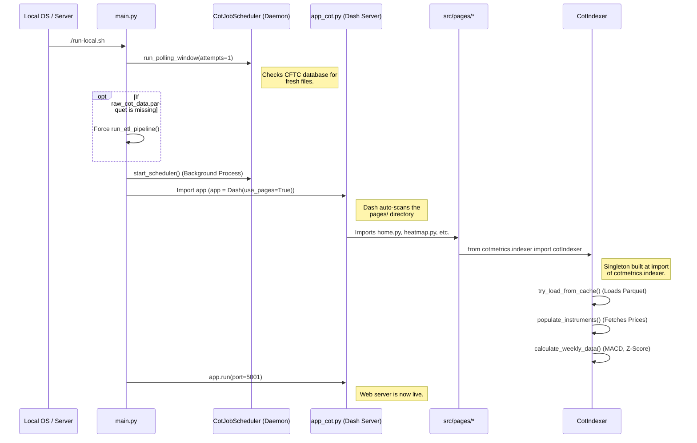
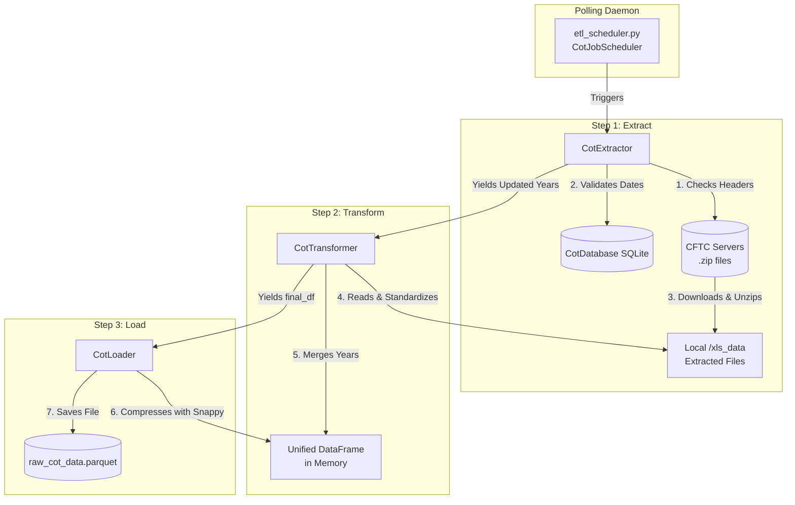
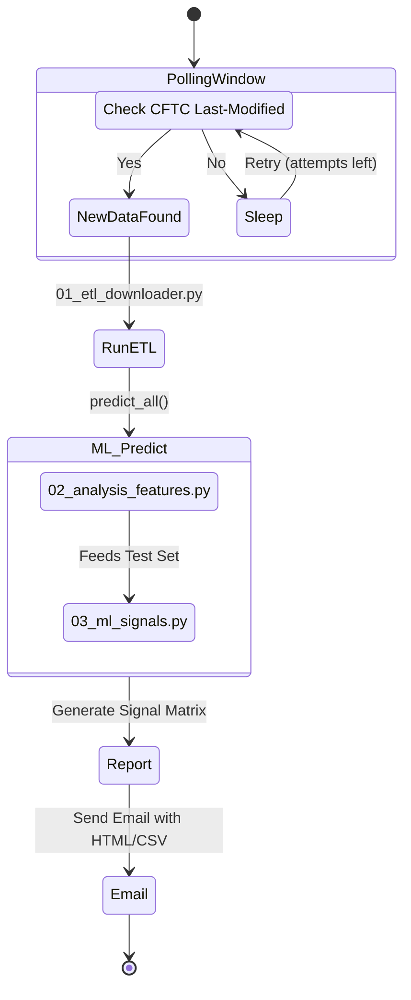

# COT Analyzer: System Architecture Overview

This document provides a high-level overview of the structural components, interactions, runtime states, and data flow of the COT Analyzer system. It does not cover specific financial algorithms or machine learning theory, focusing exclusively on software engineering architecture.

---

## 1. Runtime Liveness & Concurrency

The COT Analyzer operates as a unified Python application containing multiple concurrent execution threads and background processes, bootstrapped from a single entry point (`src/main.py`).

### Active Processes
1. **Dash Web Server (Main Process)**
   - The primary application server running a Flask/Dash web interface (`app.run()`).
   - Handles incoming HTTP requests, user sessions, and UI callbacks asynchronously.
2. **COT Data Scheduler (`CotJobScheduler`)**
   - Runs as a background `multiprocessing.Process`.
   - Constantly loops using the `schedule` library.
   - Monitors internal cron jobs (e.g., polling CFTC servers every weekday at 15:25 EST).
   - Responsible for triggering the ETL pipeline and ML inference when new data arrives.
3. **Options Data Scheduler (`daily_options_update_scheduler`)**
   - A secondary background `multiprocessing.Process` running independently to update daily options data and prices via external APIs.
   - Designed to run via standalone functions (`update_all_daily_prices` and `update_all_daily_options`) completely decoupled from `CotIndexer` to maintain a nearly-zero memory footprint.

---

## 2. Core Structural Components

The system is decoupled into logical modules, ensuring data engineering pipelines operate independently of UI rendering and data analysis.

### The repo boundary: cot-analyzer and cotmetrics

The data and metrics layer lives in a **separate package, `cotmetrics`**, installed as an
editable sibling (`requirements.txt` carries `-e ../cotmetrics[options,scheduler]`, which
in turn depends on `-e ../cotdata`). This repo holds the Dash application and nothing else.

The split matters when reading the rest of this document, so as a map:

| Concern | Lives in |
|---|---|
| ETL, scheduler, options and price fetching | `cotmetrics` |
| The indexer, indicators, signals, tape synthesis | `cotmetrics` |
| Report tables and their styling | `cotmetrics` |
| Dash pages, callbacks, plots, cards | `cot-analyzer` (this repo) |

A useful rule when deciding where something belongs: `cotmetrics` carries no presentation
config, and `cot-analyzer` computes no metrics.

### A. The Orchestrator (`src/main.py`)
- Acts as the central traffic controller.
- Spawns the scheduler processes.
- Runs a fast initial database check to force-trigger ETL builds on a cold boot if critical files (`raw_cot_data.parquet`) are missing.
- Mounts and starts the `app_cot.py` Dash server.

### B. The ETL Pipeline (`cotmetrics.pipelines.01_etl_downloader` & `cotmetrics.etl`)
A decoupled, 3-step procedural data engineering pipeline.
- **CotExtractor**: Reaches out to external servers (CFTC). Uses `HTTP Last-Modified` headers against local SQLite records to ensure idempotent downloads. Extracts `.zip` files into raw `.xls`.
- **CotTransformer**: Consolidates multiple years of disparate Excel files into a unified Pandas DataFrame, parsing strings to localized Datetime indices.
- **CotLoader**: Responsible for persistent storage, dumping the unified dataframe out to compressed `.parquet`.

### C. The ML Pipelines
Triggered automatically by the Scheduler upon fresh data ingestion. The predictive strand
now lives outside this repo, in the npf sibling, so what remains here is the trigger and
the notification rather than the modelling.
- **Feature Generation**: Normalizes raw COT positioning and price data into Machine Learning-friendly features.
- **Inference**: Applies pre-trained models against the newest incoming data.
- **Signal Generation**: Exports predictive matrices and triggers the SMTP engine to alert the user.

### D. The Singleton Indexer (`cotmetrics.CotIndexer`, reached via `cotmetrics.indexer`)
- The backbone of the analytical engine.
- Built at **import** of `cotmetrics.indexer`, which constructs the `cotIndexer` singleton.
  It therefore needs a populated data store to import at all, which is why modules that
  only want figure geometry avoid importing it (see §2.F).
- Parses `config/params.yaml` to dynamically build the asset list.
- **Runtime State**: Maintains an enormous cached DataFrame of *all* historical positioning, calculated indicators (Z-Scores, MACD, Custom Lookbacks), and pricing data for rapid read-access by the UI.
- **The UI contract** is `get_symbols_data(name, lookback, basis)`. It returns the frame
  with generic alias columns (`comms_idx`, `comms_zscore`, `willco`, `oi_zscore` and so on)
  already resolved for the requested lookback and basis. Every alias moves together, so a
  caller can never pair a normalized index with a raw z-score inside one condition set.
- Caches are busted by two counters: the upstream `cotdata` schema version, and
  `cotmetrics.constants.METRICS_CACHE_VERSION` for value-only changes in our own indicator
  logic, which the per-symbol column-presence guards cannot see.

### E. The User Interface (`src/app_cot.py` & `src/pages/`)
- A multi-page Single Page Application (SPA) built on Plotly Dash.
- Component architecture uses Bootstrap (`dash_bootstrap_components`).
- Communicates directly with the `CotIndexer` singleton to query filtered datasets and render AG Grids and Plotly graphical objects.
- Four pages stack plots: **OI Alignment**, **Analysis**, **Graphs** and **Aggregation**.
  What those plots *are* is described once, in the registry below.

### F. The Plot Layer (`src/components/plot_registry.py` and the `plot_*` modules)

A plot used to be described by five parallel structures spread across those four pages: a
label in the page's dict, a membership test in a `has_secondary` list, a branch in an
`if/elif` dispatch chain, a basis-awareness flag in `viz_constants`, and an overlay entry
in `plot_helpers`. Nothing tied them together, so adding or removing one panel meant
finding all five in every page that offered it.

**`plot_registry` is now the single description.** Each plot is one `PlotSpec`:

```python
PlotSpec("index", "Positioning Index", _index,
         secondary_y=SECONDARY_WITH_PRICE, basis_aware=True,
         overlay=("comms_idx", "Index", [0, 100], False),
         decorate=_setup_highlight)
```

Two details in that record are easy to get wrong and worth knowing:

- **`secondary_y` is not a boolean.** Net Positions and Max-Pain Premium put Open Interest
  and Delta IV on the secondary axis, which has nothing to do with the price overlay, so
  they keep it even where price is switched off. That is Aggregation's case. Hence
  `never` / `with_price` / `always`.
- **`basis_aware` is the one fact several things derive from**: which panels the model
  selector moves, which get a `(Raw)` or `(% of OI)` suffix in their title, which gain
  basis sibling variants on Analysis, and which read the normalized frame. It used to be
  stated separately in each of those places.

What the registry deliberately does **not** own is each page's **basis-resolution policy**,
because those genuinely differ. OI Alignment and Graphs apply one page-wide model, Analysis
offers per-panel variants (`index_oinorm`, `index_both`), and Aggregation has no basis
concept at all. A page decides which frame a panel should draw and hands it over in
`PlotCtx.df`.

Adding or removing a plot is a one-line change here, plus its id in the offering page's
`PLOT_IDS`.

#### The drawing modules

`plot_helpers.py` was 1668 lines doing four unrelated jobs. It is now a facade that
re-exports four modules, so `import components.plot_helpers as helpers` keeps working:

| Module | Holds |
|---|---|
| `plot_colors` | hex maths, no figure involved |
| `plot_layout` | subplot grids, axis ranges, heights, the shared layout pass |
| `plot_traces` | one function per panel, plus the trace primitives |
| `plot_options` | the max-pain curve and its premium/discount history |

The dependency graph is a line, not a web: `plot_traces` depends on `plot_colors` and
`plot_layout`, and the other three depend on no sibling at all.

All four import **without a data store**. None of them reaches the indexer at module
scope, and `plot_options` defers its indexer import into the two functions that need it.
The `plot_helpers` facade is the exception, because it also re-exports the signal cards,
which do build the indexer at import. That is why `plot_registry` imports the facade
lazily rather than at module load: most of the registry is metadata that page layout code
and tests read without drawing anything, and it should not need a populated store to be
read.

#### The y-axis autoscale

All four stacked-plot pages share one clientside function, `autoscale_y_axes` in
`assets/clientside.js`. When the reader zooms the x-axis, it rescales every y-axis to the
data actually inside the window, and on a reset it puts them all back to autorange.

It is one function rather than four because nothing in it is page-specific. The page it
should act on travels in as `State('<graph_id>', 'id')`, so each page contributes only a
`dcc.Store` to hang the callback on and one `clientside_callback` block.

Two things about it are load-bearing:

- It writes through `Plotly.relayout` and returns `no_update` for the figure. Returning a
  figure would carry the stored x-range back and undo the zoom the reader just made.
- The reset branch derives its axis list from the figure's **traces**, not from layout
  keys. `autosize` fires mid-figure-swap, when the layout still holds the previous
  figure's axes, and reading those raises.

On OI Alignment it does one extra job: it reports the rightmost visible date to
`oi_alignment_zoom_sink`, which is how the signal panel follows the zoom. That is a
separate server callback, because rebuilding the panel needs the indexer.

#### One trap worth recording

Plotly ships numeric trace columns to the browser **base64-encoded as `{dtype, bdata}`**,
not as lists. Anything reading `trace.y` or `trace.high` from a figure, on either side of
the wire, must decode first. Indexing them directly yields `undefined` in JavaScript and
raises in pandas. This silently broke the OI Alignment y-axis autoscale for a long time,
because the failure was swallowed by a bare `except`.

---

## 3. Data Stores & Caching

The application heavily utilizes caching to prevent redundant external API hits and expensive memory re-allocations.

1. **Parquet Data Lake (`data/raw_cot_data.parquet`)**
   - The primary datastore for the unified, pre-indexed Commitments of Traders dataset. Rebuilt automatically by the ETL pipeline.
2. **SQLite Metadata Store (`data/cot_data.db`)**
   - Lightweight relational database tracking system state.
   - Contains `zip_file_updates` (tracks `Last-Modified` timestamps of CFTC zip files to prevent duplicate downloading).
   - Contains a `site_visits` table for internal analytics.
3. **Market Data Cache (`data_cache/ml/*_daily.parquet`)**
   - Local append-only caches per instrument (e.g., `HE_daily.parquet`).
   - Stores daily Open, High, Low, Close, Volume, and Open Interest.
4. **Configuration State (`config/params.yaml`)**
   - Human-editable configurations defining UI themes, lookback periods, custom indicators, and the master list of tracked financial instruments.

---

## 4. Third-Party Integrations

The system is highly resilient and handles network or API failures via graceful fallbacks.

- **CFTC Servers**: Polled via `requests` to pull standard `.zip` files containing raw Legacy format `.xls` files.
- **Databento API (`cotmetrics.market_data`)**: Primary source of truth for daily OHLC and CME Open Interest. Accessed via the `databento` Python SDK (`GLBX.MDP3` dataset).
- **Yahoo Finance (`yfinance`)**: Secondary fallback data provider. Used heavily for ICE Soft commodities (Cotton, Cocoa, etc.) which are not yet supported by Databento.
- **SMTP Notification Engine**: Standard Python `smtplib` connected via SSL. Emails are dispatched exclusively by the `CotJobScheduler` after successful ETL/ML runs.

---

## 5. Instrument Symbology & Resolution

A critical structural design is the internal symbol translation layer. Because the application consumes data from the CFTC, Databento, Yahoo Finance, and TradingView, it requires a universal abstraction:

- **Internal Symbols**: The system uses standardized abbreviations (e.g., `HE`, `ZC`, `ES`). Defined in `config/params.yaml`.
- **Databento Resolvers**: The system maps internal symbols to Databento's specific CME Globex root symbols (e.g., Internal `ZC` translates to Databento `C.n.0`).
- **yFinance Resolvers**: For fallback, internal symbols are generally appended with `=F` (e.g., `HE=F`).
- **TradingView Resolvers**: UI charting widgets use mapped TV symbols (e.g., `ZC` maps to TV `CORN`).

---

## 6. System Execution Flow (Startup Sequence)

This diagram visualizes how the application boots up, showing the parallel execution of the background data polling scheduler and the Dash server, along with the lazy instantiation of the `CotIndexer`.



---

## 7. ETL Data Pipeline Architecture

This diagram breaks down the decoupled Extract, Transform, and Load steps executed by `01_etl_downloader.py`.



---

## 8. Machine Learning & Notification Flow

Visualizes what happens automatically when the background daemon detects fresh CFTC data during its scheduled polling window.


