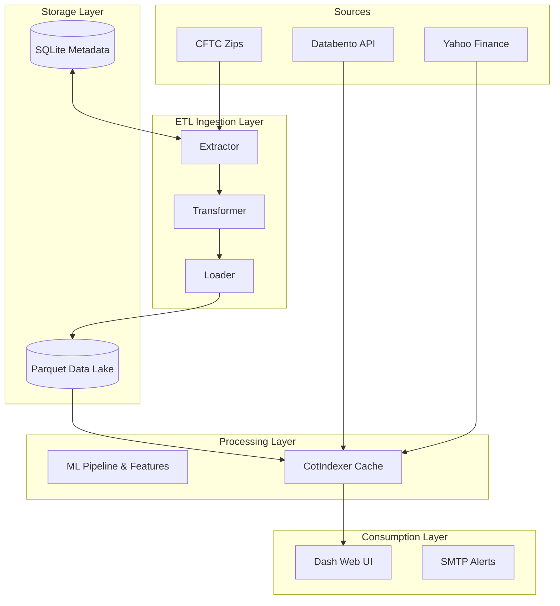

# COT Analyzer Data Architecture Document

This document defines the data architecture for the COT Analyzer system. It details the conceptual, logical, and physical data models, explains data flow and integration throughout the system, and establishes data governance and security measures.

## 1. The Three Data Models

### 1.1 Conceptual Data Model
The conceptual data model defines the high-level business entities within the COT Analyzer ecosystem and their relationships.

- **Financial Instrument**: A tradable asset (e.g., Corn, S&P 500, Gold) represented by a symbol.
- **Commitments of Traders (COT) Report**: Weekly data provided by the CFTC detailing the positioning of different types of market participants.
- **Market Data**: Daily price and volume information for financial instruments.
- **Options Data**: Derivative pricing and expiration data for financial instruments.
- **Machine Learning (ML) Signals**: Predictive outputs generated by backtesting and inference models on historical positioning.

**Relationships**:
- A *Financial Instrument* has many *COT Reports* over time.
- A *Financial Instrument* has daily *Market Data* and *Options Data*.
- *COT Reports* and *Market Data* are consumed by external systems (like `pardo_quant_framework`) for quantitative analysis and Machine Learning.

### 1.2 Logical Data Model
The logical model details the attributes of each entity and how they link together logically, independent of the underlying storage format.

- **Instrument Entity**
  - Attributes: `Symbol` (Primary Key), `Market_and_Exchange_Names`, `CFTC_Contract_Market_Code`
- **COT Positioning Entity**
  - Attributes: `Report_Date` (Key), `Symbol` (Foreign Key), `Open_Interest`, `Commercial_Long`, `Commercial_Short`, `NonCommercial_Long`, `NonCommercial_Short`, `NonReportable_Long`, `NonReportable_Short`
- **Market Price Entity**
  - Attributes: `Date` (Key), `Symbol` (Foreign Key), `Open`, `High`, `Low`, `Close`, `Volume`, `Open_Interest`
- **Options Analytics Entity**
  - Attributes: `Date` (Key), `Symbol` (Foreign Key), `Expiry`, `Underlying_Price`, `Simulated_Strike`, `Max_Pain_Strike`
- **System Metadata Entity (SQLite)**
  - Attributes: `Job_ID`, `Last_Modified_Timestamp`, `Execution_Status`

### 1.3 Physical Data Model
The physical data model describes how data is stored on disk, utilizing Parquet for columnar analytical data and SQLite for transactional metadata.

**A. Analytical Datastore (Parquet Data Lake)**
Parquet is used for dense, columnar storage of historical data, optimizing read performance for analytical queries and UI rendering.

1.  **`data/raw_cot_data.parquet` (Master COT Store)**
    - *Purpose*: Consolidated raw dataset of all CFTC reports.
    - *Schema*: `Market_and_Exchange_Names`, `Report_Date_as_MM_DD_YYYY`, `CFTC_Contract_Market_Code`, `Open_Interest_All`, `NonComm_Positions_Long_All`, `NonComm_Positions_Short_All`, `Comm_Positions_Long_All`, `Comm_Positions_Short_All`, `NonRept_Positions_Long_All`, `NonRept_Positions_Short_All`.
    - *Indexing*: Indexed by Date and CFTC Code.

2.  **`data_cache/{Symbol}.parquet` (Calculated Feature Caches)**
    - *Purpose*: Materialized views containing raw COT data merged with calculated indicators (Z-Scores, MACD, etc.) for rapid UI loading.
    - *Schema*: 124+ columns including base COT data and rolling lookback indicators (e.g., `Comm 52 Spearman Norm`, `Lrg Spec 52 Move`).

3.  **`data_cache/ml/{Symbol}_daily.parquet` (Daily Market Data)**
    - *Purpose*: Append-only local caches for daily pricing.
    - *Schema*: `Open`, `High`, `Low`, `Close`, `Volume`, `Open Interest`.

4.  **`data_cache/options/{Symbol}_options_history.parquet`**
    - *Purpose*: Historical options data used for max pain and strike analysis.
    - *Schema*: `Date`, `Expiry`, `UnderlyingPrice`, `SimulatedStrike`, `IntrinsicValue_M`, `MaxPainStrike`, `ETF_Proxy`.

**B. Metadata Store (SQLite Relational DB)**
`data/cftc_database.db` serves as a lightweight relational store.
- **`zip_file_updates` Table**: Tracks `Last-Modified` HTTP headers of CFTC zip files to guarantee idempotent downloads and prevent redundant ETL runs.
- **`site_visits` Table**: Captures internal analytics and page hit metrics.

---

## 2. Data Flow & Integration

The system uses an **ETL (Extract, Transform, Load)** methodology for batch ingestion and processing.

### 2.1 Integration & Source Systems
Data is ingested from multiple external providers:
1.  **CFTC Servers**: Primary source of truth for weekly positioning data, delivered via zipped Excel files.
2.  **Databento API**: High-frequency source of truth for daily OHLC and CME Open Interest.
3.  **Yahoo Finance (`yfinance`)**: Fallback data provider, heavily utilized for ICE Soft commodities.

### 2.2 Data Pipeline (ETL)
The ETL pipeline (`01_etl_downloader.py`) orchestrates data movement via the `CotJobScheduler`:

- **Extract**: The `CotExtractor` pings the CFTC server headers. If new data is detected (by comparing against SQLite metadata), it downloads and unzips the raw `.xls` files into local storage.
- **Transform**: The `CotTransformer` reads the raw Excel files, standardizes date formats, drops irrelevant columns, and merges multiple years into a unified Pandas DataFrame.
- **Load**: The `CotLoader` compresses the transformed DataFrame using Snappy and persists it as `data/raw_cot_data.parquet`.

### 2.3 Downstream Consumption (pardo_quant_framework)
- **Machine Learning & Walk-Forward Analysis**: The `cot-analyzer` no longer handles ML training or execution. Instead, the adjacent `pardo_quant_framework` directly consumes the Parquet files (`data_cache/{Symbol}.parquet` and `data_cache/ml/{Symbol}_daily.parquet`) to perform rigorous Walk-Forward Analysis, XGBoost model training, and performance evaluation.

### 2.4 Consumption Layer
- **Singleton Indexer (`CotIndexer.py`)**: A centralized data access layer that lazy-loads Parquet caches into memory upon the first UI request.
- **Dash Web Server**: Queries the `CotIndexer` to render Plotly visualizations, AG Grids, and heatmaps on the frontend.
- **SMTP Engine**: Dispatches HTML/CSV reports containing predictive ML signals to subscribed users.

### Data Flow Diagram

---

## 3. Data Governance & Security

### 3.1 Data Ownership & Stewardship
- Data ingested from the CFTC is public-domain and stored locally without modification to its core values.
- The `CotJobScheduler` acts as the system owner for the extraction process, ensuring pipeline integrity.
- Intermediate derived data (Z-Scores, MACD, Options pricing) are wholly owned by the application.

### 3.2 Data Quality & Validation
- **Idempotency**: The extractor validates HTTP `Last-Modified` timestamps before downloading to prevent duplicate or partial data pulls.
- **Schema Enforcement**: Pandas enforces strict data typing during the Transformation phase before writing to Parquet.
- **Fallback Mechanisms**: If the primary price provider (Databento) fails or is missing symbols (e.g., ICE Softs), the system gracefully degrades to Yahoo Finance.

### 3.3 Role-Based Access Control (RBAC) & Security
- **Local Application Access**: Since the application is currently designed for single-tenant local or dedicated server deployment, strict intra-app RBAC is not enforced at the database level.
- **File System Permissions**: Parquet files and SQLite databases rely on host OS file system permissions. 
- **Secret Management**: External API keys (e.g., Databento) are kept out of source control and managed via environment variables.

### 3.4 Data Lineage
- **Raw to Unified**: `xls_data/` -> `CotTransformer` -> `data/raw_cot_data.parquet`.
- **Unified to Cached**: `raw_cot_data.parquet` + `config/params.yaml` -> `CotIndexer` -> `data_cache/{Symbol}.parquet`.
- **Downstream Export**: `data_cache/{Symbol}.parquet` and daily price parquets are consumed by `pardo_quant_framework`.
This clear lineage ensures transparency; any errant metric on the frontend can be traced back through the Cache to the Raw unified file, and ultimately to the CFTC source zip.

### 3.5 Compliance & Retention
- Historical data is retained indefinitely within the Parquet lake as it forms the basis for ML backtesting and long-term trend analysis.
- PII (Personally Identifiable Information) is not collected, apart from potentially basic analytics logged in the `site_visits` table which are kept internal to the host.
