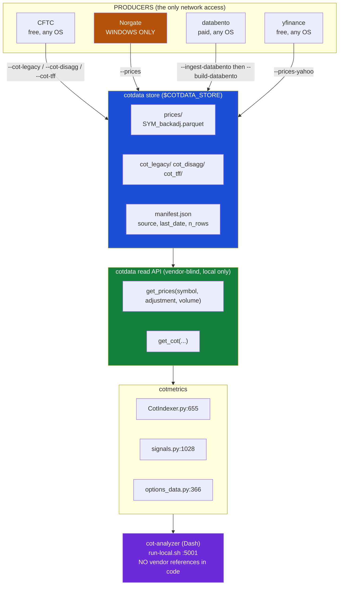
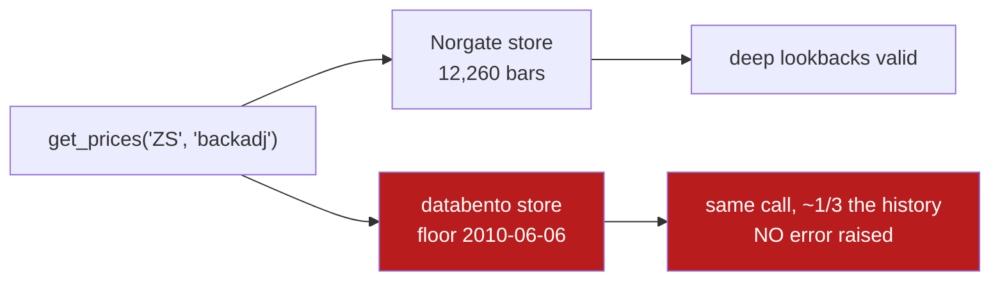
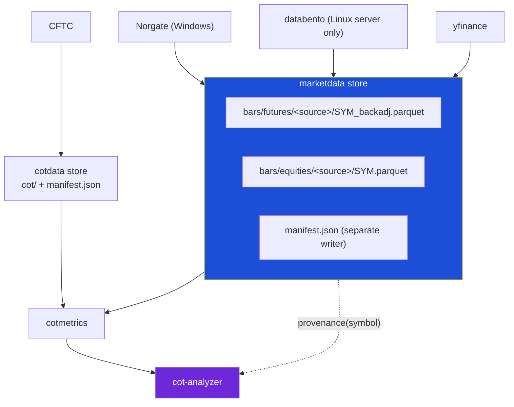

# How data reaches cot-analyzer

cot-analyzer never talks to a data vendor. It never even calls the price API directly.
Every number on the dashboard arrives through two layers of indirection, and the store
is the boundary where vendor identity stops mattering.

Verified 2026-07-26 by reading the source, not the docs. **Re-verified 2026-08-08, and the
read path changed**: ADR-0007 step 4 landed in `cotmetrics` (commit `1290ec0`), so bars now
arrive through `marketdata.get_bars` and `cotdata.get_prices` is no longer called from
`cotmetrics/src` at all. See "The read path today" below before trusting the older diagram.

## Current path (superseded 2026-08-08, kept for the vendor argument)



## Which vendor serves what, today

Read from the live store manifest: **47 symbols norgate, 2 yahoo**. The mix is per-symbol,
not per-deployment, so "which vendor" never had one answer even locally.

`COTDATA_PRICE_SOURCE` picks the deployment default. A symbol uses its explicit override
first, then the default when that vendor can serve it, then a Yahoo fallback where a
ticker exists. One provider owns a symbol end to end and a series is never blended
(ADR-0006).

## Where the abstraction is real

Complete, at the code level. Every mention of Norgate or databento inside `cot-analyzer/src`
and `cotmetrics/src` is a comment or a docstring. Not one is functional. `get_prices` takes
no vendor argument. Swapping the producer changes no consumer line.

## Where it leaks

The store hides the vendor. It does not hide vendor differences, and all three of these
are silent.



**History depth.** databento's GLBX.MDP3 floor is hardcoded at 2010-06-06
(`cotdata/src/cotdata/providers/databento.py:201`). A lookback window longer than that
runs on truncated data and nothing complains.

**Reconstructed volume degrades quietly.** Only the Norgate path writes
`Volume_Reconstructed` and `Volume_Source`. `prices.py:145` handles the absence on
purpose, labelling everything `raw`. So `get_prices(volume="reconstructed")` returns true
reconstructed volume on one store and front-month volume on the other, same call, no error.
`Volume_Source` exists so a consumer can tell, but cotmetrics does not check it.

**Coverage gaps shift the vendor.** Markets off CME Globex (ICE softs, lumber, MSCI) are
not on databento at all and fall back to Yahoo, so a databento deployment is really a
databento-plus-Yahoo deployment.

## The read path today

Measured 2026-08-08 against the working tree and both live stores, updated 2026-08-09 when
the bars landed and the boot guard shipped. Each claim below carries its own date.

**The consumers have moved. The bytes have not.** ADR-0007 is shipping as separate steps and
these two are out of step with each other:

| | state |
|---|---|
| step 4, repoint consumers | **done**. `cotmetrics` reads `marketdata.get_bars(symbol, "backadj")` at `CotIndexer.py:752`, `signals.py:1030`, `options_data.py:366`. `grep get_prices cotmetrics/src` returns nothing |
| step 2, move the producer code and the bars | **on ice**. `providers/databento.py` has no owner |

So the read now points at `$MARKETDATA_STORE/bars/futures/`, while 99 price parquets still
sit in `$COTDATA_STORE/prices/` where the producer keeps writing them.

**This fails silently, which is the part to remember.** A futures read against a store with
no `bars/futures/` does not raise. It returns an empty frame:

```python
marketdata.get_bars("GC", "backadj")   # -> 0 rows, no error
```

The app still boots, binds :5001, and renders every COT page, because positioning comes from
the other store and is unaffected. Only price overlays and the price-dependent signals go
blank. Both failure modes below therefore look like a UI regression rather than a data one:

- `MARKETDATA_STORE` unset: raises, but late, on the first bar read rather than at startup.
  `run-local.sh` checks it upfront for this reason.
- `MARKETDATA_STORE` set and populated with `bars/equities/` only: no error anywhere.

**Both are now caught at boot rather than on a chart.** `main.py::check_price_store` asks
`marketdata.coverage_gaps` about the configured universe before the indexer is built, and
refuses to start when nothing at all is present. See "Refusing early", below.

**The bars themselves landed on 2026-08-09**, through marketdata's
`scripts/import_from_cotdata.py`: 49 symbols, 98 series, every cell verified identical to
the cotdata copy. So the local store now serves prices. The gap this section describes is
closed, and the section is kept because the *shape* of the failure is what the guard was
built against, and because the underlying split has not gone away:

**The bars now exist in BOTH stores, and nothing reconciles them.** cotdata's Windows
producer keeps writing `prices/`, and marketdata's copy only moves when the import is
re-run. Until step 2 lands, every producer run leaves this store one week behind, which
the boot guard reports as `stale` rather than as an error.

Confirm before trusting a chart:

```bash
python -c "import marketdata; print(len(marketdata.get_bars('GC','backadj')))"
```

## Target path after ADR-0007

`cotdata` keeps CFTC positioning only. All bars move to `marketdata`, which already holds
the `equities` domain and would gain `futures`.



Both stores may share one synced parent folder. They must not share a `manifest.json`,
because `_touch_manifest` is a read-modify-write and concurrent producers lose entries.

The dotted edge is the fix for the leaks above: `marketdata.provenance(symbol)` returns
source, date span, row count and `covers(start)` from the manifest without opening a
parquet, so the dashboard can show what backs a chart and a startup check can refuse a
lookback the store cannot support.

## Refusing early

**Half of that dotted edge is built.** The startup check shipped on 2026-08-09 in
marketdata `coverage_gaps` / `require_coverage` and cot-analyzer's
`main.py::check_price_store`. The UI badge has not: nothing on the site yet says which
vendor and which date span back a chart, so the history-depth leak above is still silent
*within* a rendered chart even though it is now loud at boot.

```
check_price_store()   ->   marketdata.coverage_gaps(universe, stale_after_days=7)
                           absent | empty | short | stale, one per STORED TIER
```

| what the store looks like | what happens |
|---|---|
| every configured instrument served | one INFO line and the app boots |
| **nothing at all** | every gap logged, then `sys.exit(1)` |
| a subset absent, short or stale | gaps logged, warning, app boots |

The asymmetry is deliberate. Nothing at all is a deployment error and no chart on the site
can work, which is precisely the condition that went unnoticed for days. A subset is a data
gap, and taking the positioning half of the site down for it would be the worse trade.
`COT_ANALYZER_ALLOW_MISSING_PRICES=1` downgrades the refusal for a deliberately COT-only
deployment.

`get_bars` itself was deliberately NOT changed. `_missing` in `bars.py` returns an empty
frame for a symbol absent everywhere on purpose, because the store is registry-free and a
caller probing for a one-off symbol should get an honest empty answer rather than an
exception. The loudness belongs to the deployment, which has already committed to a
universe, not to the read.
